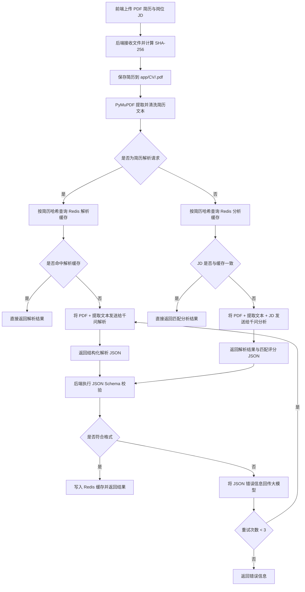

# CVAssistant

`CVAssistant` 是一个基于大模型的简历解析与岗位匹配系统。系统支持上传 PDF 简历，先通过 `PyMuPDF` 提取简历文本，再结合上传的 PDF 文件与岗位 JD 调用千问模型进行结构化解析和匹配评估，返回标准化 JSON 结果。

项目当前采用前后端分离架构：
- 后端：`FastAPI`
- 前端：`Vue 3 + Vite`
- 大模型：`DashScope / Qwen`
- 缓存：`Redis`

## 项目架构

整体流程如下：



1. 用户在前端上传 PDF 简历，并输入岗位 JD。
2. 后端接收文件后，按文件内容计算 SHA-256，并将简历保存到 `app/CV/<sha256>.pdf`。
3. 后端先使用 `PyMuPDF` 对 PDF 做文本提取与清洗。
4. 解析简历时：
   - 先按简历哈希查询 Redis 是否已有解析结果
   - 若命中，直接返回缓存结果
   - 若未命中，则将 PDF 文件和提取出的文本一起交给千问解析
5. 匹配分析时：
   - 先按简历哈希查询 Redis
   - 若存在分析缓存，再判断缓存中的 JD 是否与本次 JD 一致
   - 一致则直接返回缓存结果
   - 不一致则重新调用大模型分析
6. 大模型返回 JSON 后，后端会进行结构化校验（JSON Schema）；若格式不符合预期，会携带错误信息重试，最多 3 次。

目录结构如下：

```text
.
├─ app
│  ├─ api              # 路由层
│  ├─ core             # 配置与应用基础能力
│  ├─ models           # Pydantic 数据模型
│  ├─ prompt           # 大模型提示词
│  ├─ services         # 业务逻辑层
│  └─ CV               # 上传后的简历文件存储目录
├─ frontend            # Vue 前端
├─ Dockerfile          # 后端镜像构建文件
├─ requirements.txt    # 后端依赖
└─ README.md
```

## 技术选型

### 后端

- `FastAPI`
  负责提供简历解析、匹配分析、健康检查等 HTTP API。

- `Pydantic / pydantic-settings`
  用于配置管理、请求响应校验以及大模型返回结果的结构化约束。

- `PyMuPDF`
  用于从 PDF 中提取文本，辅助大模型更稳定地理解简历内容。

- `Redis`
  用于缓存简历解析结果和匹配结果，减少重复调用模型的开销。

### 前端

- `Vue 3`
  负责页面状态管理与结果展示。

- `Vite`
  负责本地开发和生产构建。

### 大模型

- `DashScope OpenAI Compatible API`
  统一以 OpenAI 兼容接口方式接入。

- `Qwen`
  用于简历解析、岗位匹配与结果生成。

## 核心功能

- PDF 简历上传
- 简历结构化解析
- 岗位 JD 匹配评分
- 一键分析
- Redis 缓存命中
- JSON 结构校验与失败重试

## 环境变量说明

项目运行依赖 `.env` 或系统环境变量，`.env.example` 仅作为示例模板。

推荐配置如下：

```env
LLM_API_KEY=yourKey
LLM_MODEL=qwen3.5-plus
LLM_BASE_URL=https://dashscope.aliyuncs.com/compatible-mode/v1

REDIS_HOST=RedisHost
REDIS_PORT=6379
REDIS_PASSWORD=yourPassword
REDIS_DB=0

CORS_ORIGINS=*
```

## 使用说明

### 后端接口

#### 1. 解析简历

接口：

```text
POST /api/v1/resumes/parse
```

表单参数：

- `file`：PDF 简历文件

返回内容：

- 简历清洗文本
- 结构化候选人信息
- 缓存命中状态

#### 2. 计算匹配度

接口：

```text
POST /api/v1/resumes/match
```

表单参数：

- `file`：PDF 简历文件
- `job_description`：岗位 JD

返回内容：

- 提取后的候选人信息
- 匹配评分结果
- 缓存命中状态

#### 3. 一键分析

接口：

```text
POST /api/v1/resumes/analyze
```

表单参数：

- `file`：PDF 简历文件
- `job_description`：岗位 JD

返回内容：

- 简历解析结果
- 匹配评分结果
- 缓存命中状态

#### 4. 健康检查

接口：

```text
GET /api/v1/health
```

## 部署方式

### 方式一：通过 `git clone` 部署

适用于本地开发或自行维护 Python 运行环境的服务器。

#### 1. 克隆项目

```bash
git clone https://github.com/scrazyakai/CVAssistant.git
cd CVAnalysisAssistant
```

#### 2. 创建虚拟环境并安装依赖

Windows：

```bash
python -m venv .venv
.venv\Scripts\activate
pip install -r requirements.txt
```

Linux：

```bash
python3 -m venv .venv
source .venv/bin/activate
pip install -r requirements.txt
```

#### 3. 配置环境变量

复制 `.env.example` 为 `.env`，并填写真实配置：

```bash
cp .env.example .env
```

然后修改 `.env`：

```env
LLM_API_KEY=yourKey
LLM_MODEL=qwen3.5-plus
LLM_BASE_URL=https://dashscope.aliyuncs.com/compatible-mode/v1

REDIS_HOST=RedisHost
REDIS_PORT=6379
REDIS_PASSWORD=yourPassword
REDIS_DB=0

CORS_ORIGINS=*
```

#### 4. 启动后端

```bash
uvicorn app.main:app --host 0.0.0.0 --port 8000
```

开发模式可使用：

```bash
uvicorn app.main:app --host 0.0.0.0 --port 8000 --reload
```

#### 5. 启动前端

```bash
cd frontend
npm install
npm run dev
```

如果要指定前端请求地址，可在前端环境中配置：

```env
VITE_API_BASE=https://你的后端域名/api/v1
```

### 方式二：使用 Docker 部署

适用于服务器直接拉取现成镜像运行。

#### 1. 拉取镜像

```bash
docker pull crazyakai/cvassistant:1.0
```

#### 2. 运行容器

```bash
docker run -d \
  --name cvassistant-container \
  -p 8000:8000 \
  -e LLM_API_KEY="yourKey" \
  -e LLM_MODEL="qwen3.5-plus" \
  -e LLM_BASE_URL="https://dashscope.aliyuncs.com/compatible-mode/v1" \
  -e REDIS_HOST="RedisHost" \
  -e REDIS_PORT="6379" \
  -e REDIS_PASSWORD="yourPassword" \
  -e REDIS_DB="0" \
  -e CORS_ORIGINS="*" \
  crazyakai/cvassistant:1.0
```

如果你已经通过 Nginx 或网关做了 HTTPS 反向代理，推荐将前端请求地址配置为：

```env
VITE_API_BASE=https://你的域名/api/v1
```

而不是直接使用 `:8000` 端口。

#### 3. 查看容器日志

```bash
docker logs -f cvassistant-container
```

#### 4. 测试服务

```bash
curl http://127.0.0.1:8000/api/v1/health
```

## 前端部署建议

前端可以部署到 GitHub Pages，部署时建议将 `VITE_API_BASE` 指向已经启用 HTTPS 的后端地址，例如：

```env
VITE_API_BASE=https://你的域名/api/v1
```

注意：
- GitHub Pages 页面是 `https`
- 浏览器不允许 `https` 页面直接调用 `http` 接口
- 因此后端正式环境建议务必配置 HTTPS

## 生产环境建议

- 为后端绑定域名并启用 HTTPS
- 使用 Nginx 或网关将 `443` 反向代理到应用 `8000` 端口
- 将真实密钥放入部署平台环境变量中，不要写入 `.env.example`
- 开启 Redis 认证
- 为大模型和 Redis 配置超时与监控

## 常见问题

### 1. 前端提示 `Failed to fetch`

通常是以下原因：

- 前端页面是 `https`，后端仍然是 `http`
- CORS 配置不正确
- 后端域名没有完成 HTTPS 配置

### 2. 容器启动时报 Redis 认证错误

请检查：

- `REDIS_HOST`
- `REDIS_PORT`
- `REDIS_PASSWORD`
- `REDIS_DB`

### 3. 容器启动时报 `cors_origins` 解析错误

推荐直接使用：

```env
CORS_ORIGINS=*
```

或：

```env
CORS_ORIGINS=http://localhost:5173,http://127.0.0.1:5173
```

## 许可与说明

本项目当前为学习与业务验证用途。若用于正式生产环境，建议进一步补充：

- 用户鉴权
- 日志审计
- 文件安全控制
- OCR 能力
- 异常监控与告警
